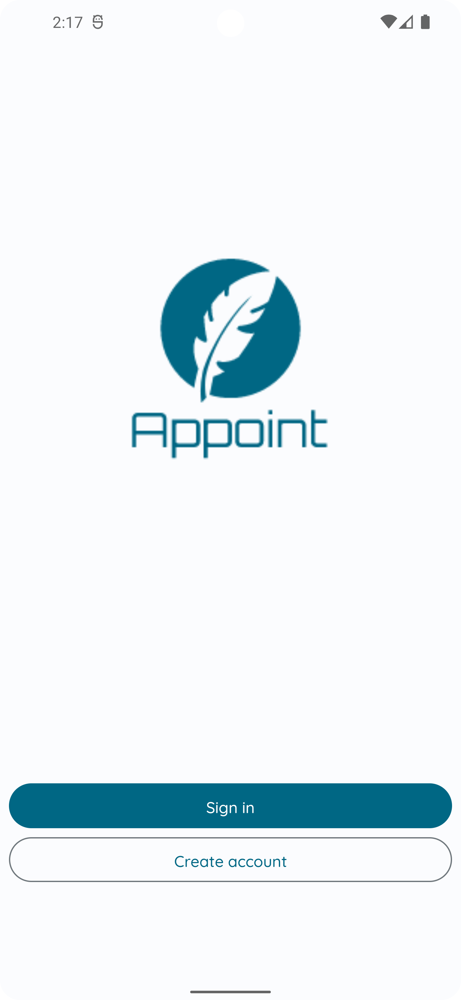
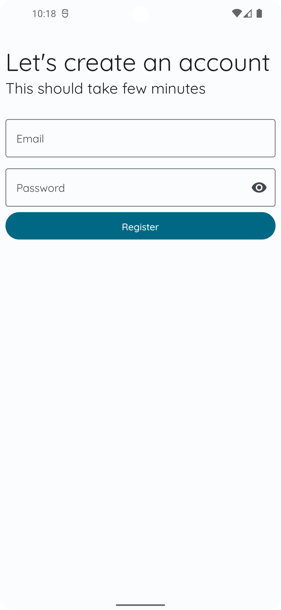
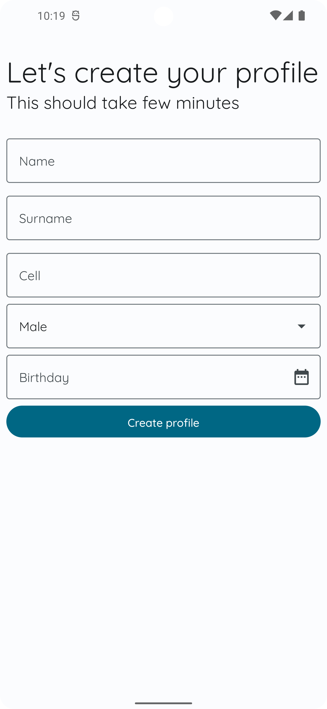
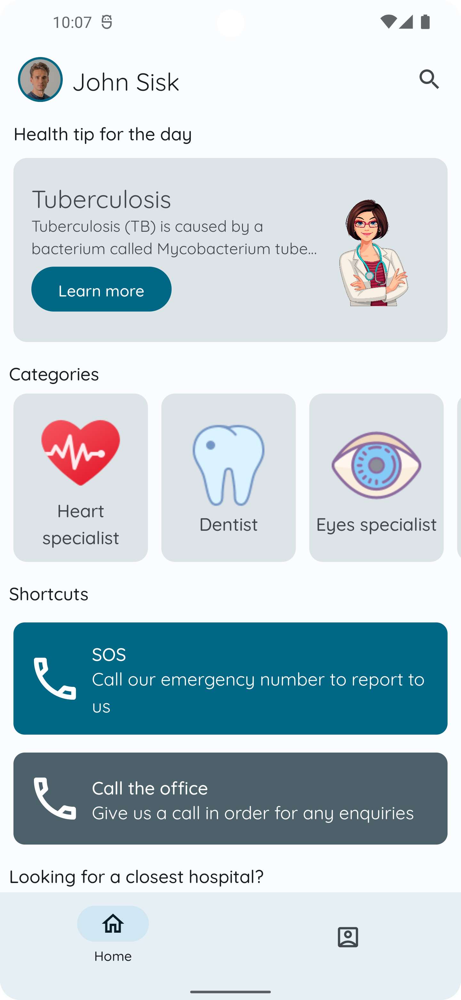
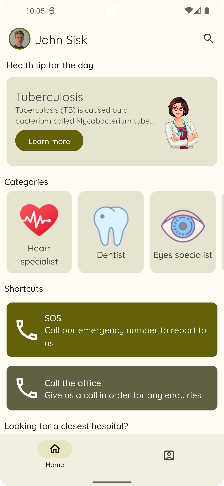
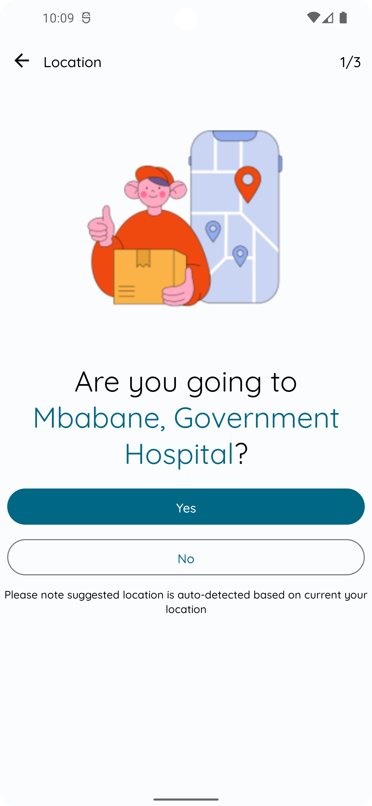
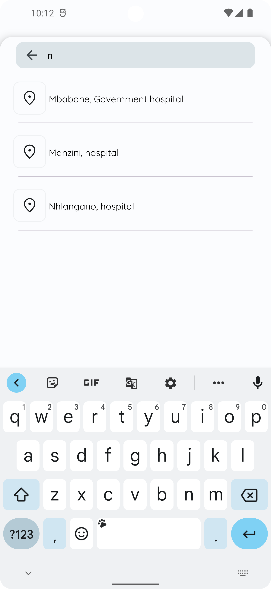
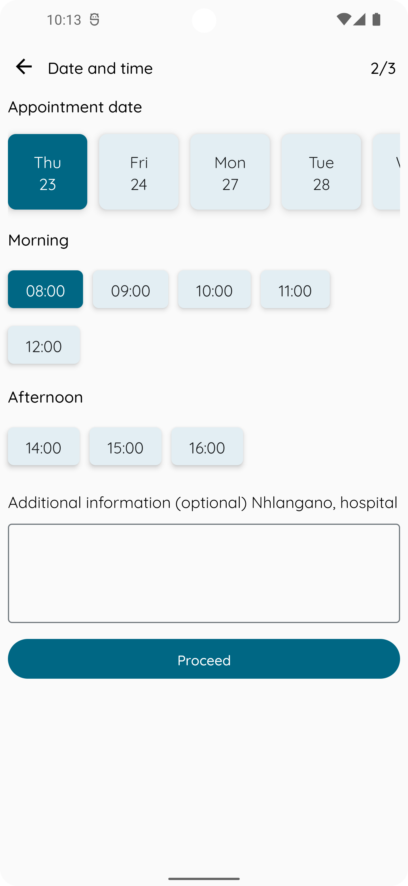

# ⚠️ APPLICATION STILL IN DEVELOPMENT
this mobile application, API and admin dashboard is still under development, therefore some features might not be fully functional as intended

## APPOINT
APPOINT is an application that can be used by organizations or individuals to allow their clients to book an appointment for several services that are offered. This application can be used for different types of businesses, in this project i used a medical institution as an examplele. This medical institution offer several services such as dental services, laboratory services etc. 

## Demo
### Registration
  

### Home
Application use dynamic theming,  enables users to personalize their devices to align tonally with the color scheme of their personal wallpaper or through a selected color in the wallpaper picker
 
 

### Booking steps

  

